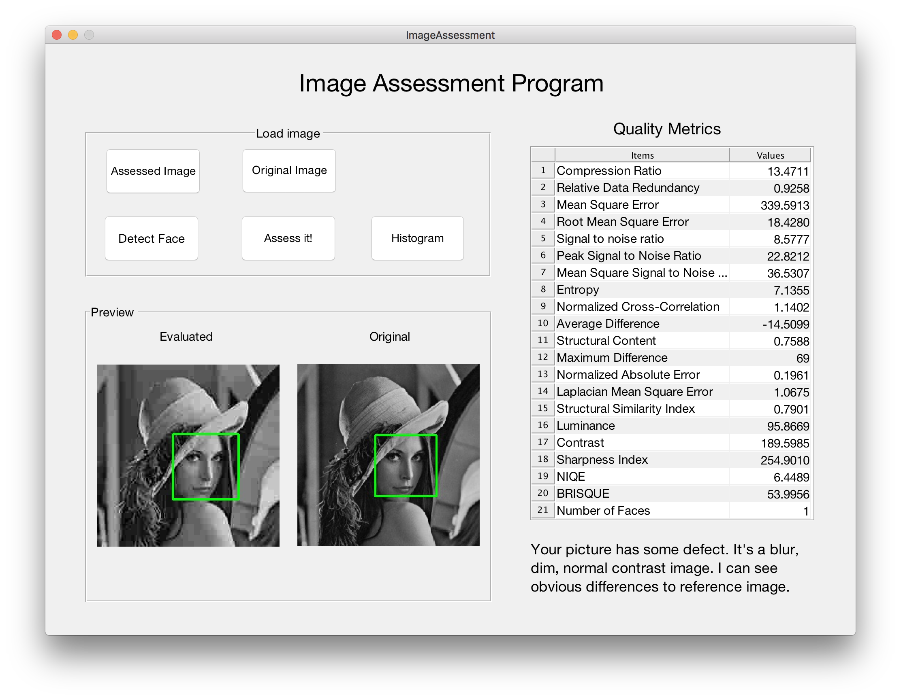
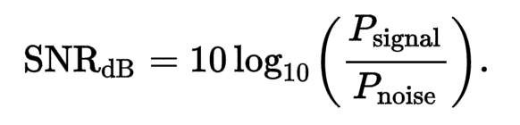
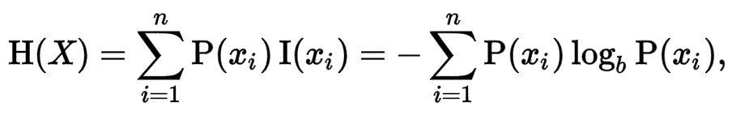
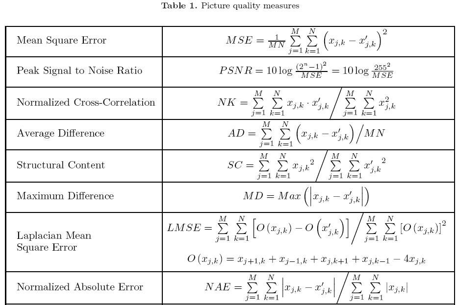
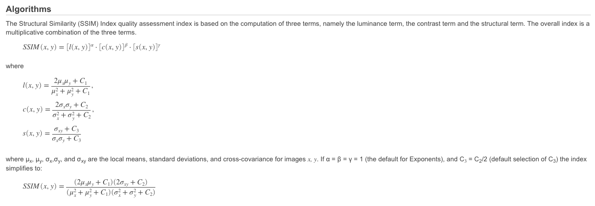

# DIP_Project
Digital Image Processing Course Project

-----

### How to use
* ImageAssessment.fig -> UI file
* ImageAssessment.m   -> UI functions
* ./func              -> functions folder(add to path first)
* ./src               -> resources(include test img)
* Open application:
    - load image want to be evaluated and original image
    - assess image
    - face detection

### References
> quick review of the functions.  
> cite: [sharpness metric](http://www.mi.parisdescartes.fr/~moisan/papers/2011-33.pdf)

* Mean Squared Error(MSE)
    - the difference between the estimator and what is estimated
* RMSE
    - represents the sample standard deviation of the differences between predicted values and observed values
* Signal-to-noise ratio(SNR)
    - compares the level of a desired signal to the level of background noise.
    - In image processing: the ratio of the mean pixel value to the standard deviation of the pixel values over a given neighborhood

* PSNR
    - used to measure the quality of reconstruction of lossy compression codecs (e.g., for image compression)
    - The signal in this case is the original data, and the noise is the error introduced by compression
    - When comparing compression codecs, PSNR is an approximation to human perception of reconstruction quality
    - <25 bad quality; 25-35 can see differences; >37 differences can hardly distinguish
* MS-SNR
    - any meaning?
* Entropy
    - Entropy is defined as `sum(p.*log2(p))` where p contains the histogram counts returned from IMHIST.
    - unit: bits/pixel  -> how much info in each pixel

* Normalized Cross-Correlation
    - cross-correlation is a measure of similarity of two series as a function of the displacement of one relative to the other
* Average Difference
    - total sum of error divide size of pic
* Structural Content
    - calc structural similarity
    - The large value of Structural Content (SC) means that image is poor quality.
* Maximum Difference
    - max value of error in pic
    - The large value of Maximum Difference (MD)
means that image is poor quality
* Laplacian Mean Square Error
    - This measure is based on the importance of edges measurement
    - The large value of Laplacian Mean Square Error (LMSE) means that image is poor quality. 
* Normalized Absolute Error
    - total sum of absolute error divide sum of origin pic value
    - The large value of Normalized Absolute Error(NAE) means that image is poor quality
* SSIM
    - SSIM is used for measuring the similarity between two images. 
    - The SSIM formula is based on three comparison measurements between the samples of x and y: luminance l, contrast c and structure s.
* Luminance
    - convert rgb2hsv, use mean value of v.(0-1) -> v*255(0-255)
    - bigger value brighter 
* Contrast
    - calc the squared sum of ceter pixel value and four neighbor values, then divide by the number of squared terms
    - bigger value more contrast
* Sharpness
    - faster than Global Phase Coherence, using Gaussian random field. 
    - see paper
    - higher is sharper
* NIQE
    - calculates the no-reference image quality score for image A using the Naturalness Image Quality Evaluator (NIQE).
    - A smaller score indicates better perceptual quality.
* Brisque
    - calculates the no-reference image quality score for image A using the Blind/Referenceless Image Spatial Quality Evaluator (BRISQUE).
    - A smaller score indicates better perceptual quality.

* Structural Similarity Index (SSIM)
    - Computation of three terms: luminance, contrast, structural
    - The overall index is a multiplicative combination of the three terms

